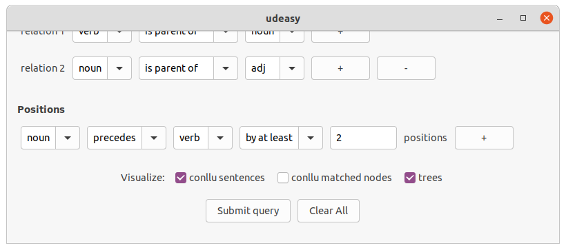
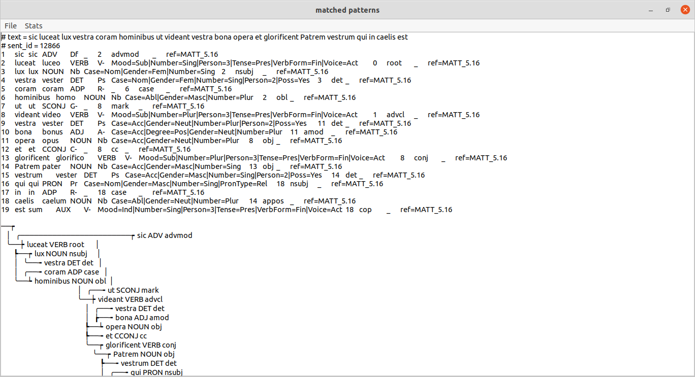
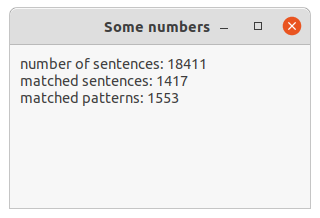
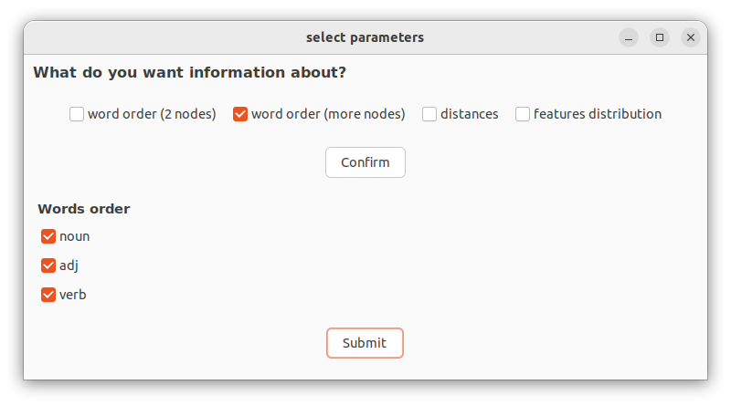
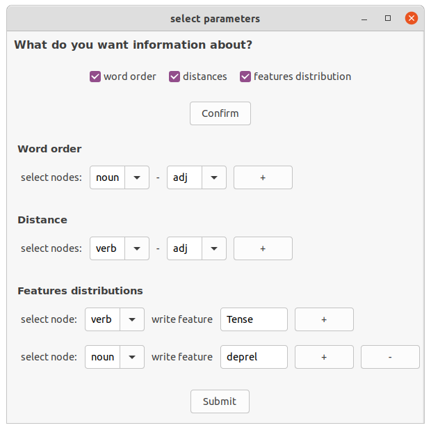

# How to use UDeasy

## Download UDeasy

Go to the [download page](download.md).

## Tutorial

Now we will see how to use UDeasy.

### The main frame

When opening UDeasy, a window like the one in the picture appears.

Clicking on the button `Choose file`, a file dialog opens and allows the user
to navigate in the computer files.
When the user selects the conllu file containing the treebank they want to
query, the path to the selected file appears on the main frame. The user
can now press on the `Confirm button`.

### Giving a name to the target nodes

When clicking on the `Confirm button`, the nodes panel appears. The user
here is asked to give a name to the nodes that are involved in the patterns
they want to get from the treebank.

These names allow the user to refer to the target nodes in the next steps.

The user can now proceed to the next step clicking on the button _Confirm_.

**new in version 1.0.0**

It is now possible to include optional nodes in the query. To do so, just click the
_optional_ box in the corresponding node.

### Selecting the features for each target node

In the panel that appears, the user can indicate one or more features that
the target nodes involved in the pattern must match.

The user can select any of the conllu fields (`lemma`, `upos`, `deprel`) or any
of the sub-features that some conllu fields have such as `feats` and `misc`. For
instance, in the figure above, the user has selected `VerbForm`, `Gender` and
`Case`.

As values for the selected features, the user can either enter one or more
values that have to be matched. If the user enters a value, then the feature
must have that exact value for the node; if more values are passed, they
have to be written between squared brackets and separated by commas. If
the feature has one of those values, then the node is included in the results.

The user can also exclude from the results those nodes that match a certain value
(or group of values) selecting the `value is not` option from the dropdown menu in
between the feature menu and the feature value.

In the feature dropdown menu the user will find all the conllu field and some of
the sub-features of `feats` and `misc`: if they want to look for a sub-feature not
included in the menu, they can insert the value from the keyboard.

### Specifying the relations among nodes

After the selection of the features, the user can specify the syntactic
relations among the nodes.

The relations must involve only two nodes and the possible values for them
are:

* `is parent of`
* `is ancestor of`
* `is sibling of`

### Specifying the relative positions among nodes

The last parameter the user might want to specify is the relative positions
among the nodes.

As the relations, also the relative positions conditions must involve two
nodes. If the user does not want to specify any ordering among the nodes,
they can leave the fields empty. Otherwise, they must give a value for the
first three fields, i.e. the nodes and the ordering relation (`precedes` or
`follows`). In addition to that, they can specify a distance between the
nodes selecting either `by exactly` or `by at least` in the fourth field and
entering an integer number.

### Visulizing the results

Before submitting the query, the user can select some visualization options
such as `conllu sentences`, `conllu matched nodes` and `trees`: ticking the first
box, the user will see in the results the conllu sentence that contains a
target pattern; ticking the second box, the user will see in the results the
conllu line for the matched nodes in the pattern (otherwise they will only
see the word-forms); finally, ticking the third box, the user will see in
the results the trees corresponding to the sentence containing a matched
pattern.

### Results

As a matter of example, we can see the results window that pops when the user
clicks on the button `Submit query`.

In the menu, the user will see two items: File that will open a dropdown
menu showing the `Save as...` option allowing the user to save the results
as a txt file, and `Stats` that will show two options:

* `Stats`: the user will be allowed to select some statistical information
they want to get from the results of the query

* `Count results`: the user will see a window showing some preliminary
statistics about the results

### Statistics

#### Preliminary statistics

Selecting the option `Count` results option in the `Stats` menu, the user
will see a window popping up in the screen showing some preliminary
statistics about the results.

#### Advanced statistics

Selecting the option `Stats` option in the `Stats` menu, the user will be
allowed to select some information they want to get from the results of the
query.

The options are:

* `word order (2 nodes)`: this option allows the user to see the orderings of two
selected nodes in terms of absolute count and frequencies.

* `distances`: this option allows the user to see the distribution of the
distances between two nodes. If a node preceded immediately another,
then the distance between them is 1, if there is a word between them,
then it's 2 and so forth. The user will see a table with all the distances
and the count of how many times a certain distance between the two
selected nodes occurs. In addition to that, the average distance
between the two nodes is shown.

* `features distribution`: this option allows the user to see the
distribution of values that one or more features have. If more than
one feature are selected, then the table will show the co-occurrences
of those features.

**new in version 1.0.0**

* `word order (more nodes)`: this option allow the user to see the ordering among more than
two nodes. To do so, the user has to select the boxes corresponding to the nodes they want to
include in the query.

##### Example

*The stats panel*

*The results of the `Word order` and `Distance` queries*

*At the bottom of the page, the result of the `Features distributions` query*

### Exporting the results

From any window showing results (patterns or stats) it is possible to export the content
to a txt file. To do so, just select the _File > Save as..._ option in the menu and choose
the path where to save the txt file.

**new in version 1.0.0**

It is also possible to export the results as csv files:

* export the patterns: in the results window select `File > Export as csv` and select a path where
to store the csv file. The dataframe will have the following columns:
  * sent_id
  * text
  * a column for each target node

* export the stats: in the stats window, select `File > Export csv(s)` and select a directory where
to store the csv files. UDeasy will give automatically a name to these files (`stats_results_[number].csv`).