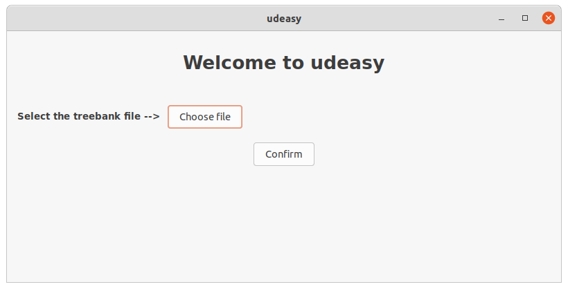

# How to use udeasy

## Download udeasy

Go to the [download page](download.md).

## Install udeasy

udeasy does not need any installation process. Double-click on the executable that you downloaded
and use it!

## Tutorial

Now we will see how to use udeasy.

### The main frame

When opening udeasy, a window like the one in the picture appears.

Clicking on the button _Choose file_, a file dialog opens and allows the user
to navigate in the computer files.
When the user selects the conllu file containing the treebank they want to
query, the path to the selected file appears on the main frame. The user
can now press on the _Confirm button_.

### Giving a name to the target nodes

When clicking on the _Confirm button_, the nodes panel appears. The user
here is asked to give a name to the nodes that are involved in the patterns
they want to get from the treebank.

### Selecting the features for each target node

### Specifying the relations among nodes

### Specifying the relative positions among nodes

### Visulizing the results

### Get some numbers
